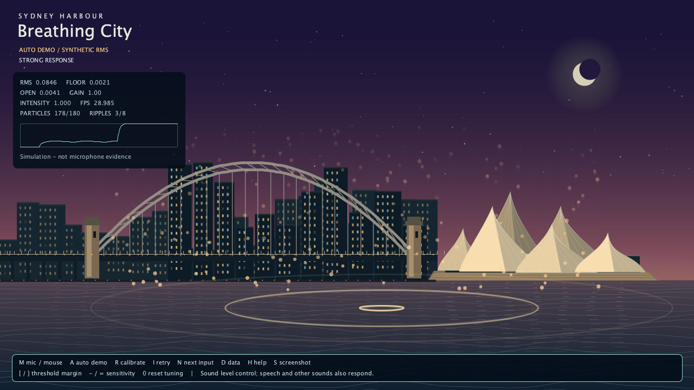

# Breathing City

An interactive, code-drawn Sydney Harbour night scene. Microphone loudness controls the sky, building and landmark lights, water, particles and expanding ripples. Quiet input produces a restrained response; stronger input produces brighter light and faster movement. The image settles smoothly after input stops.

**Final runnable sketch: [`BreathingCity/BreathingCity.pde`](BreathingCity/BreathingCity.pde).** Open this file, not the archived baseline. Keep all five code files in the same `BreathingCity` folder. The scene contains a stylised Harbour Bridge and Opera House, built from geometric shapes.

This is an AI-assisted revision of the supplied prototype. It measures sound level, not the identity of a breath. Speech, music and other sufficiently loud sounds can also activate it.



## Features

- Real microphone capture through the official Processing Sound library; input selection and reconnect controls.
- Three seconds of quiet calibration, a robust noise estimate, adjustable threshold margin and sensitivity, and hysteresis.
- Frame-rate-independent attack/release smoothing.
- Distinct light, water, particle and ripple responses; continuously strengthened ripple events.
- Mouse simulation and a labelled automatic demonstration, usable without microphone access.
- A guided one-minute microphone test, a live data panel, and PNG screenshot saving.
- Fixed scene arrays, a 180-particle cap, an eight-ripple cap and finite effect lifetimes.

## Actual tested environment

| Component | Version actually used |
|---|---|
| Processing | **4.5.7**, Java mode, revision 1435 |
| Processing Sound library | **2.4.0**, library revision 18 |
| Java used by Processing sketches | Bundled Temurin **17.0.20.1+1** |
| Sound dependency | JSyn **17.1.0**, included with Sound |
| Test operating system | **macOS 26.6.2, Apple Silicon arm64** |
| Renderer / window | Default JAVA2D, 1280 × 720, pixel density 1 |

These are measured versions, not untested minimum requirements. Windows/Linux and different Processing/Sound versions have not been verified here. A separate system JDK is unnecessary for normal use in the Processing editor.

See [dependencies and assets](docs/runtime-dependencies.md) for exact download URLs, hashes, optional authoring tools and licensing/source notes. The delivered sketch does **not** require Python, ffmpeg, a browser, an API key or network access at runtime.

## Installation

1. Download **Processing 4.5.7** for your OS from the [official release](https://github.com/processing/processing4/releases/tag/processing-1435-4.5.7). Extract/install and launch Processing.
2. Select **Java** mode in the mode selector.
3. Select **Sketch → Import Library → Manage Libraries**, search for **Sound**, and install the official Processing Sound library. This project was tested with **2.4.0**.
4. If the manager offers a different version and an exact reproduction is needed, download [official Sound 2.4.0](https://github.com/processing/processing-sound/releases/download/v2.4.0/sound.zip). Close Processing, extract the ZIP's `sound` folder into the `libraries` directory of your sketchbook, and reopen Processing. The resulting path should be `SKETCHBOOK/libraries/sound/library/sound.jar`; avoid a nested `sound/sound` folder or duplicate installations.
5. Unzip this project to a writable local folder. Keep `BreathingCity/SignalEnvelope.java` together with all four `.pde` files.
6. Open `BreathingCity/BreathingCity.pde`. Processing should show the additional code tabs automatically.

## Run

1. Press **Run** in Processing. The default mode is the real microphone.
2. Allow the microphone permission requested by the OS. If permission is changed after launch, press **I** to reconnect; restarting Processing may be necessary.
3. Remain quiet during calibration. The panel shows the measured floor and opening threshold.
4. Breathe or blow gently towards the microphone from a comfortable distance. Compare gentle and stronger input, then stop and watch the decay. Avoid blowing directly against the microphone grille.
5. If background sound activates the scene, press **R** in the normal room environment and stay quiet; increase the margin with **]** if necessary. If useful input is too weak, increase sensitivity with **=**. If both gentle and strong inputs saturate, reduce sensitivity with **-**.
6. Press **G** for on-screen instructions for a one-minute human trial: quiet, gentle input, stronger input, stop/recovery. This requests actions; the participant must confirm what they actually did.

For a microphone-free check, press **M** and move the mouse left/right inside the sketch, or press **A** for an automatic sequence. These modes are clearly labelled and must not be presented as real breath-test evidence. The Sound library is still required to compile the project.

## Controls

| Key | Action |
|---|---|
| M | Switch between microphone and mouse simulation |
| A | Start/restart the automatic synthetic-input demonstration |
| G | Start the guided 60-second human microphone trial |
| R | Recalibrate the active microphone; restart calibration in auto demo |
| I | Reconnect microphone and recalibrate |
| N | Select the next input-capable audio device and recalibrate |
| [ / ] | Decrease/increase threshold margin by 0.0005 |
| - / = or + | Divide/multiply sensitivity by 1.25 |
| 0 | Restore margin 0.002 and sensitivity 1.0 |
| D | Toggle the data panel |
| H | Toggle the keyboard help |
| S | Save a timestamped PNG under `BreathingCity/screenshots/` |
| Esc | Close the sketch |

Tuning is intentionally session-only. Mouse mode controls visual intensity directly: it does not sample RMS and bypasses microphone threshold and sensitivity. Neither simulation mode records microphone audio. Recalibrating or changing the input device cancels a guided trial; press G to start a fresh one.

## Files for the assessor

```text
BreathingCity_A2/
├── README.md                           Start here
├── BreathingCity/                      FINAL RUNNABLE SKETCH
│   ├── BreathingCity.pde                Setup, modes, UI, guided test, evidence
│   ├── BreathInput.pde                 Sound input lifecycle and devices
│   ├── SignalEnvelope.java             Calibration, gate, gain and smoothing
│   ├── CityScene.pde                   Sydney landmarks, lights and water
│   └── VisualEffects.pde               Bounded particles and ripples
├── docs/
│   ├── runtime-dependencies.md         All assets, versions and dependencies
│   ├── runtime-test-report.md          What was actually run and measured
│   ├── code-walkthrough.md             English technical explanation
│   ├── study-guide-zh.md               Chinese revision and explanation guide
│   ├── reflection-draft.md             Evidence-based reflection for completion
│   ├── project-journal.md              Recorded revision process
│   ├── issue-log.md                    Defects, changes and evidence
│   ├── concept-map-start.svg/.png      Reconstructed baseline concept map
│   ├── concept-map-final.svg/.png      Revised implementation concept map
│   ├── data-flow.svg/.png              Audio-to-image pipeline
│   ├── references.md                   APA 7 references and contributions
│   ├── course-sources-needed.md        Unverified course-source requirements
│   ├── peer-feedback-form.md           Blank form for real peer feedback
│   ├── genai-declaration.md            Accurate assistance disclosure
│   └── evidence/                      Actual screenshots, CSVs and reports
├── video/
│   ├── BreathingCity_3min_Explainer.mp4 Three-minute project/code explanation
│   ├── captions.srt                       Captions
│   └── README.md                       Capture and synthetic-narration provenance
├── tests/                              Tests against production code and results
├── tools/                              Optional verification/video tools
└── archive/baseline-2026-10-01/          UNMODIFIED supplied baseline and documents
```

## Validation and evidence

**Chinese edition:** [三分钟中文讲解视频](video/zh/BreathingCity_3min_Explainer_zh-CN.mp4) · [中文字幕](video/zh/captions.zh-CN.srt). The original English edition is retained.

The baseline and final sketch were compiled using real Processing, not API stubs. Actual demo frames and an initial microphone capture are retained. Automated numeric/state tests operate on the production classes. See the [runtime test report](docs/runtime-test-report.md) and [test instructions](docs/runtime-test-instructions.md) for exact results and limits; screenshot mode labels distinguish simulated input from microphone observations.

The English and Chinese video editions contain actual Processing-rendered demo frames, readable code excerpts and synthetic narration in their respective languages. It is a study/explanation aid; course rules may require the student to record their own voice and demonstration.

## Known limitations and troubleshooting

- **Sound level is not breath recognition.** Speech, keyboard noise, wind and music may trigger the scene. Calibration reduces ordinary background triggering but cannot isolate breathing.
- **Calibration requires quiet.** Its 90th percentile tolerates isolated clicks, not sustained speech. Press R after changing rooms, microphones or OS input gain.
- **Sensitivity is device-dependent.** If intensity remains at 1 for both gentle and strong input, lower gain. If it stays near 0, check raw RMS, permission, selected device and threshold before increasing gain.
- **No microphone / no signal:** press I to retry, N to try another listed input, or M/A for simulation. The console prints devices. A new or removed device may require restarting Processing if the OS audio backend caches its device list.
- **Sound import error:** install Sound and restart Processing. M/A cannot bypass a missing compile-time library.
- **Library startup error:** verify architecture and library installation. The tested ARM Mac used Sound's default JavaSound backend; do not force its x86-only macOS PortAudio binary.
- **Slow machine:** the animation uses elapsed time, with pauses clamped to 0.1 seconds. Long stalls therefore slow animation time. Recording every PNG lowers FPS and is not a benchmark of ordinary interactive performance.
- **No persistent settings:** threshold and sensitivity reset on restart. Screenshots require a writable project directory.
- **Human/academic evidence:** peer feedback and five genuine course materials must come from the student/course. Public technical references are not automatically course sources. The active reflection identifies missing evidence; archived historical claims are unverified inherited material.

## Sources and contribution

The Sound API connection follows the official [Amplitude](https://processing.org/reference/libraries/sound/Amplitude) interface example. Official [AudioIn](https://processing.org/reference/libraries/sound/AudioIn) and [inputDevice](https://processing.org/reference/libraries/sound/Sound_inputDevice_) documentation establish stream and device semantics. Processing drawing and interpolation references support the visual implementation. The procedural geometry, project-specific envelope, effects, UI and tests were written for this AI-assisted revision; no external scene code, image, music, texture, video or font file is loaded by the sketch.

Full APA 7 entries, baseline-only references and each source's actual contribution are in [references.md](docs/references.md). Assistance and provenance are in [genai-declaration.md](docs/genai-declaration.md). No tutor permission, peer feedback or personal learning experience is assumed.
