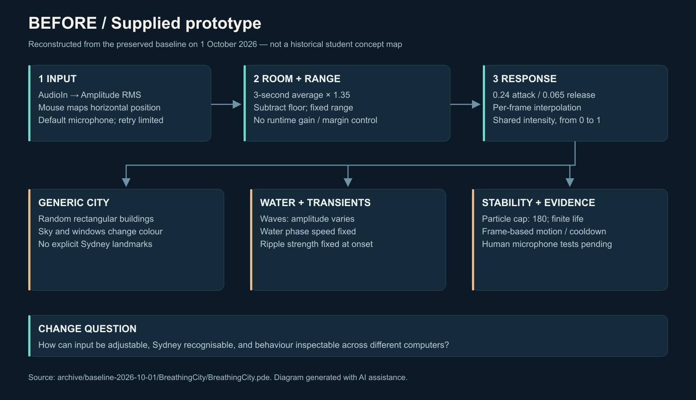
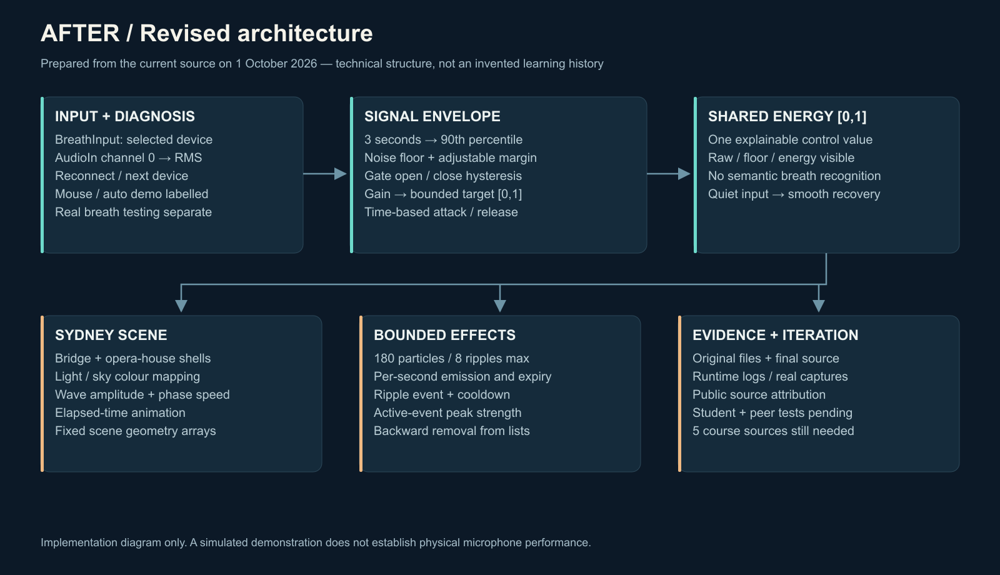

# Critical reflection working document / 反思工作稿

**Status: evidence-based development analysis with required student/course/peer sections still incomplete.** Do not submit this as a finished first-person learning narrative. No genuine peer feedback or course materials have been supplied for this revision; the required course-source count is **0 / 5**. The technical sources below are verified public references, not verified course readings.

## 1. Evidence that can already support a reflection

The supplied project was not empty: its original sketch contained a live-amplitude pipeline, procedural skyline, particle lifecycle and mouse simulation. The practical problem was the gap between those implemented mechanisms and the stated experience. Generic buildings did not communicate Sydney clearly; sensitivity was fixed; wave height changed while wave speed did not; and rings captured their strength near the crossing threshold. The preserved [baseline](../archive/baseline-2026-10-01/BreathingCity/BreathingCity.pde) and current code make these changes inspectable. [Project journal](project-journal.md) entries J1–J3 identify when this revision examined those issues.

This gives a concrete theme for reflection: visual polish and runnable interaction are separate achievements. A city can look plausible while still responding poorly to a particular microphone or room. `Amplitude` reports RMS sound level, and `AudioIn` supplies input samples; neither recognises the semantic category “breath” (Processing Foundation, n.d.-a, n.d.-b). Treating the artwork as sound-amplitude interaction therefore gives a more defensible claim than promising breath recognition. The limitation affects testing: speech and other sounds are legitimate confounds to document, not errors to silently remove from the record.

The revision also makes design choices visible as parameters. Calibration estimates a room level; the threshold decides when a signal becomes active; gain changes the range of sound required for a strong response; smoothing determines the compromise between immediacy and calm recovery. The raw number has no inherent correspondence to warm sky colours or wave height. Those relationships are authored mappings. Processing's range and colour interpolation functions provide the operations, but the selected ranges are project decisions (Processing Foundation, n.d.-d, n.d.-e).

Elapsed-time updates address another distinction: a requested frame rate is not a guaranteed one (Processing Foundation, n.d.-c). Animating with elapsed time measured by `System.nanoTime()` makes durations and speeds less dependent on how many frames a computer renders (Oracle, n.d.). It does not prove that rendering will remain smooth on every machine. That claim needs measured frame-rate and duration evidence from the runtime report. Similarly, bounded particle/ripple collections prevent unlimited object growth, but object limits alone do not establish a successful long-run performance test.

## 2. Compare the two concept diagrams

**Figure 1.** Baseline architecture reconstructed on 1 October 2026 from the preserved code. This is a retrospective technical diagram, not a falsely backdated early student concept map.

**Figure 2.** Revised architecture prepared on 1 October 2026. Calibration, gate state, time-based smoothing, shared energy, event strength and resource limits are explicit.

A defensible comparison describes the code: the baseline already had calibration and smoothing, so it would be inaccurate to claim that the revision invented them. The revision makes calibration more robust, adds adjustment and diagnostics, improves landmark recognition, and separates continuous visual energy from the management of event objects. To discuss personal learning, add what the student actually understood at each stage, using their own annotations or recorded explanation rather than the diagrams alone.

## 3. Actual runtime evidence and the remaining personal account

The revision now has concrete results rather than only a test plan. The real Processing build passed; signal tests passed 11 cases and 547 assertions, and a production-effects harness passed 324,012 assertions over 30 **simulated** minutes. These checks support the tested numerical behaviour and object bounds. They do not establish a 30-minute uninterrupted graphics/audio run or usability for a human participant.

The user agreed to a one-minute guided microphone trial, and the app recorded 62.005 seconds with changing real input and no reported capture error. With a calibrated floor of 0.001740, median processed energy was 0 in the quiet phase, 0.0182 in the prompted gentle phase, 0.5715 in the prompted strong phase and 0 again in the final phase. This is evidence of numerical separation in the labelled periods. At the time of writing, confirmation that the prompts were actually followed and the user's judgement of the visual response were still outstanding. The journal records the full phase statistics and this distinction.

The gentle result also raises a useful question: a visible system can have a large strong response while leaving ordinary light input almost imperceptible. If the user confirms that the gentle action was performed and looked too subtle, increasing sensitivity and repeating the same action would be an evidence-based revision. It would be premature to claim that such a change already happened. Likewise, the recovery interval includes a raw input maximum of 0.11147 as well as a high initial energy value; its early activity cannot be attributed solely to smoothing without checking the time series and the participant's actions.

The measured mean/minimum FPS in that trial were 50.376/25.675 while video encoding was running concurrently. That context matters: a number without its load conditions can be misleading. Read the [runtime report](runtime-test-report.md) for exact files, environment and later test results. The [three-minute video](../video/BreathingCity_3min_Explainer.mp4) demonstrates the running artwork using labelled synthetic input and synthetic English narration; the real microphone trial is separate evidence.

For the student's personal account, complete this paragraph only after confirming what actually occurred:

> On **[date]**, I opened **[exact final file/version]** using **[Processing version]** and **[Sound version]** on **[OS and input device]**. During **[test]**, I observed **[what actually occurred]**, recorded in **[filename]**. The displayed quiet/soft/strong levels were **[measurements]**. I changed **[one parameter or code section]** because **[reason]**. Retesting produced **[measurement/observation]**. This supports **[limited conclusion]**, but does not yet establish **[remaining uncertainty]**.

Keep failed permission/device tests and unexpected results. Do not write that the microphone “worked reliably” based only on a successful synthetic demonstration.

## 4. Add real peer feedback and response

No feedback is currently available. Use [peer-feedback-form.md](peer-feedback-form.md) to collect it. Then write one evidence chain:

> **[Peer/pseudonym]** tried **[mode and task]** on **[date]** and **[observed action or consented quotation]**. This challenged my assumption that **[specific assumption]**. I accepted/rejected the suggestion because **[reason]**, changed **[specific code/design]**, and retested **[same task]**. The result was **[actual result with file reference]**.

A peer's name alone or an invented positive comment does not meet this purpose. Explain disagreements or suggestions not adopted when they reveal a real tradeoff.

## 5. Integrate at least five actual course sources

The [course-source register](course-sources-needed.md) has five empty slots. For each supplied course source, read it and connect its specific concept to one real decision or observation:

| Slot | Project evidence to discuss | Required course connection |
|---|---|---|
| C1 | RMS input is not semantic breath recognition | A course argument about data, interpretation or interaction |
| C2 | Shared energy changes several visible parameters | A course principle about mapping or creative coding |
| C3 | Continuous response and event objects need different state | Course treatment of functions, objects or state |
| C4 | A recorded failed test, change and retest | Course method for iteration, debugging or evaluation |
| C5 | AI-generated baseline and student verification | Course discussion of authorship, reflection or responsible assistance |

For each, include an APA 7 in-text citation and a complete real reference. The topics above are suggested connections, not invented lecture content. Course readings may challenge a design choice; they do not all need to endorse it.

## 6. Authorship, assistance and next steps

The genuine process includes extensive AI assistance. The baseline was described by the user as ChatGPT-generated; this revision used Codex for code changes, documentation, diagrams and technical verification. A useful reflection distinguishes access to an explanation from the ability to independently explain or modify the program. The student can demonstrate that distinction by predicting a parameter change, making it, comparing the outcome with the prediction, and explaining one failure without merely reading generated prose.

Add the student's actual contribution and learning here: **[completed actions and evidence]**. Check the [AI declaration](genai-declaration.md) against the real assistance and applicable course rules. Do not reuse inherited claims about tutor permission without evidence.

## References currently usable in the technical analysis

The complete verified APA 7 entries and attribution details are in [references.md](references.md). Copy only sources actually discussed into the final reflection, keeping the suffixes consistent. Add the five verified course sources after they are supplied. No placeholder should remain in a submitted version.

## Evidence appendix checklist

- Before/after source code and checksum manifest.
- Actual runtime report, screenshots and logs, with input modes visible.
- Both concept diagrams with their reconstruction dates and provenance.
- Completed peer form and a change/retest arising from it.
- Five real course sources with page/time notes and APA 7 citations.
- Genuine AI prompt/output evidence and an accurate declaration.
